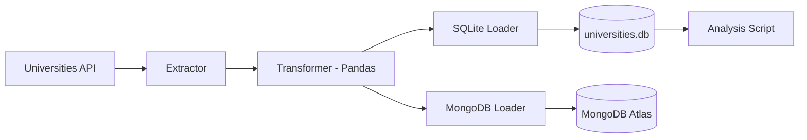

# 🎓 University ETL Pipeline - Engenharia de Dados

Este projeto é uma solução robusta de Engenharia de Dados desenvolvida para a disciplina de **Engenharia de Dados**. Ele implementa um pipeline ETL (Extração, Transformação e Carga) para coletar dados de instituições de ensino superior ao redor do mundo.

---

## 📖 Proposta do Projeto

O objetivo deste projeto é construir uma infraestrutura de dados capaz de consumir a [Universities API](http://universities.hipolabs.com/), realizar processos de limpeza e padronização dos dados (Data Wrangling) e persistir os resultados em múltiplas camadas de armazenamento: uma local (SQLite) para acesso rápido e uma em nuvem (MongoDB Atlas) para escalabilidade.

## 🏗️ Arquitetura da Solução

A solução segue os princípios de **Programação Orientada a Objetos (POO)** de forma enxuta:

1.  **pipeline.py**: Contém a classe `UniversityETL` que gerencia todo o fluxo (Extração, Transformação, Carga e Análise).
2.  **main.py**: Script minimalista que executa o pipeline via encadeamento de métodos.

---

## 🔄 Fluxo de Dados



---

## 🚀 Como Executar

### 1. Pré-requisitos
*   Python 3.10+
*   Conta no [MongoDB Atlas](https://www.mongodb.com/cloud/atlas)

### 2. Configuração do Ambiente
Clone o repositório e instale as dependências:
```bash
pip install -r requirements.txt
```

### 3. Variáveis de Ambiente
Crie um arquivo `.env` na raiz do projeto baseado no `.env.example`:
```bash
MONGODB_URI=sua_uri_do_mongodb_atlas
DB_NAME=university_db
COLLECTION_NAME=universities
SQLITE_DB=universities.db
```

### 4. Executando o Pipeline e Análise
Para iniciar o processo de ETL e gerar o dashboard automaticamente, execute:
```bash
python main.py
```

O script solicitará o país e realizará todas as etapas, salvando os dados e gerando o gráfico de análise (`analise_<pais>.png`) na raiz do projeto.

---

## 🛠️ Tecnologias Utilizadas
*   **Python**: Linguagem principal.
*   **Pandas**: Manipulação e análise de dados.
*   **PyMongo**: Integração com MongoDB Atlas.
*   **Matplotlib**: Visualização de dados.
*   **Requests**: Consumo de API REST.
*   **Dotenv**: Gestão de configurações seguras.

---

## 👥 Integrantes do Grupo
*   Gabriel Farias
*   Ewerton Monteiro
*   Dayanne Moraes
*   Lucas Matheus
*   Douglas Araujo
