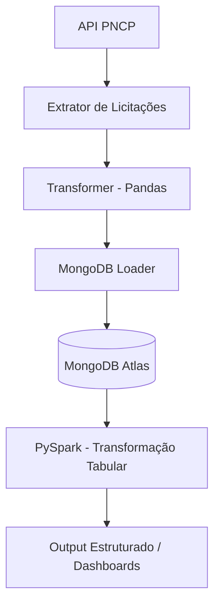

# 🎓 LicitaMEI: Democratizando o Acesso a Compras Públicas através da Engenharia de Dados

Este projeto é uma solução completa de **Engenharia de Dados** desenvolvida para o ecossistema **LicitaMEI**. Ele implementa um pipeline ETL automatizado para coletar, processar e distribuir oportunidades de licitações públicas brasileiras especificamente filtradas para Microempreendedores Individuais (MEI).

---

## 📖 Proposta do Projeto

O objetivo é facilitar o acesso do pequeno empreendedor ao mercado de compras governamentais. O pipeline consome dados reais do **PNCP (Portal Nacional de Contratações Públicas)**, identifica licitações com benefícios exclusivos para MEI/EPP (conforme a Lei 14.133/2021) e organiza essas informações para alimentar o aplicativo mobile LicitaMEI.

## 🏗️ Arquitetura da Solução

A solução utiliza tecnologias modernas de Big Data e Orquestração para garantir a confiabilidade dos dados:

1.  **pipeline.py**: Contém a lógica de extração da API do PNCP, transformação inicial com Pandas e carga.
2.  **spark_transform.py**: Módulo de Big Data que utiliza **PySpark** para acessar os dados no MongoDB Atlas e realizar transformações complexas para análise tabular.
3.  **orchestrate_prefect.py**: Orquestrador que gerencia todo o ciclo de vida do dado, incluindo a orquestração do Spark.
4.  **Bancos de Dados**: 
    *   **SQLite**: Armazenamento local para cache.
    *   **MongoDB Atlas**: Banco de dados NoSQL em nuvem (Camada de Dados Brutos/Processados).

---

## 🔄 Fluxo de Dados (LicitaMEI + Spark)



---

## 🚀 Como Executar

### 1. Pré-requisitos
*   Python 3.10+
*   Java 8+ (Necessário para o PySpark)
*   Dependências listadas em `requirements.txt`

### 2. Executando o Pipeline Completo
Para rodar a busca e o processamento Spark:
```bash
python orchestrate_prefect.py
```

---

## 🛠️ Tecnologias Utilizadas
*   **Prefect**: Orquestração de fluxos (Workflow Automation).
*   **PySpark**: Processamento de dados em larga escala (Big Data).
*   **Pandas**: Manipulação de dados inicial.
*   **MongoDB Atlas**: Armazenamento em nuvem.
*   **Requests**: Integração com a API do PNCP.

---

## 👥 Integrantes do Grupo
*   Gabriel Farias
*   Ewerton Monteiro
*   Dayanne Moraes
*   Lucas Mateus
*   Douglas Araujo
