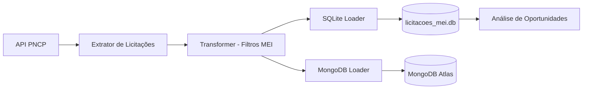

# 🎓 LicitaMEI: Democratizando o Acesso a Compras Públicas através da Engenharia de Dados

Este projeto é uma solução completa de **Engenharia de Dados** desenvolvida para o ecossistema **LicitaMEI**. Ele implementa um pipeline ETL automatizado para coletar, processar e distribuir oportunidades de licitações públicas brasileiras especificamente filtradas para Microempreendedores Individuais (MEI).

---

## 📖 Proposta do Projeto

O objetivo é facilitar o acesso do pequeno empreendedor ao mercado de compras governamentais. O pipeline consome dados reais do **PNCP (Portal Nacional de Contratações Públicas)**, identifica licitações com benefícios exclusivos para MEI/EPP (conforme a Lei 14.133/2021) e organiza essas informações para alimentar o aplicativo mobile LicitaMEI.

## 🏗️ Arquitetura da Solução

A solução utiliza tecnologias modernas de Big Data e Orquestração para garantir a confiabilidade dos dados:

1.  **pipeline.py**: Contém a lógica de extração da API do PNCP, transformação com Pandas (Data Wrangling) e carga em múltiplos destinos.
2.  **orchestrate_prefect.py**: Orquestrador que gerencia o fluxo de trabalho, garantindo retentativas em caso de falha e permitindo o agendamento diário.
3.  **Bancos de Dados**: 
    *   **SQLite**: Armazenamento local para cache e processamento rápido.
    *   **MongoDB Atlas**: Banco de dados NoSQL em nuvem para alimentar o aplicativo mobile em tempo real.

---

## 🔄 Fluxo de Dados (LicitaMEI)



---

## 🚀 Como Executar

### 1. Pré-requisitos
*   Python 3.10+
*   Dependências listadas em `requirements.txt`

### 2. Executando o Pipeline
Para rodar a busca de licitações agora:
```bash
python orchestrate_prefect.py
```

Para configurar o robô para rodar automaticamente (Agendamento):
```bash
python orchestrate_prefect.py serve
```

---

## 🛠️ Tecnologias Utilizadas
*   **Prefect**: Orquestração de fluxos (Workflow Automation).
*   **Pandas**: Processamento e limpeza de dados.
*   **Requests**: Integração com a API do PNCP.
*   **MongoDB & SQLite**: Persistência de dados.
*   **Matplotlib**: Geração de dashboards de insights.

---

## 👥 Integrantes do Grupo
*   Gabriel Farias
*   Ewerton Monteiro
*   Dayanne Moraes
*   Lucas Mateus
*   Douglas Araujo
