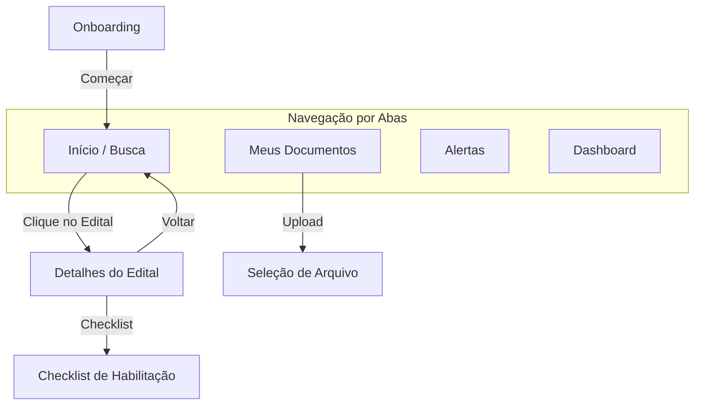

# Mapa de Navegação - LicitaMEI

Este documento descreve o fluxo de navegação do aplicativo, conforme definido no Milestone 1.

## Fluxograma de Navegação

## Descrição das Rotas

1.  **Onboarding**: Apresentação inicial do valor do app para o MEI.
2.  **Home (Início)**: Listagem de editais com barra de busca e filtros.
3.  **Documentos**: Central de gestão de arquivos de habilitação (CCMEI, CNDs, etc).
4.  **Alertas**: Notificações push e avisos de prazos.
5.  **Dashboard**: Histórico de participações e estatísticas de sucesso.
6.  **Detalhes do Edital**: Visão profunda de uma oportunidade específica com checklist integrado.
